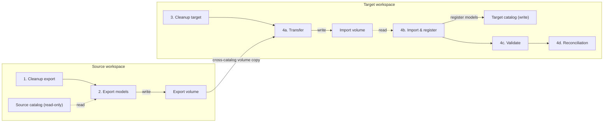

# Databricks UC Model Migration

Migrate MLflow registered models between two Unity Catalog catalogs on the **same metastore** using Databricks Asset Bundles. Source models are read-only and never modified. Model names, versions, metrics, params, tags, aliases, and direct UC grants are all preserved on the target.

Works on both serverless and classic compute, in the same workspace or across two workspaces that share a metastore.

## What you get

- **Two bundles**: `source/` (deploys to the source workspace) and `target/` (deploys to the target workspace). Same workspace is fine — use the same profile for both.
- **Four jobs**, run in order:
  1. `src_model_migration_cleanup` — clears the export volume in the source catalog.
  2. `src_model_export` — exports model artifacts, metadata, and grants to the export volume.
  3. `tgt_model_migration_cleanup` — clears the import volume and deletes any prior migrated models in the target.
  4. `tgt_model_migration_register` — copies from source to target, registers in the target catalog, validates, and reconciles.
- **Provenance tags** on every migrated run: `migration.source_model`, `migration.source_version`, `migration.source_run_id`, `migration.flavor_path`.
- **Reconciliation report** at the end comparing version counts and aliases between source and target.

## What gets migrated

| Item | Migrated |
|---|---|
| Registered model versions (artifacts) | Yes |
| Metrics, params, custom tags | Yes |
| Aliases (`Champion`, `Challenger`, `Shadow`) | Yes |
| Model signature | Yes |
| Direct UC grants on the model | Yes |
| Model lineage (downstream tables, jobs) | No — must be reconnected on the target |
| Source experiments | No — a fresh migration experiment is created in the target |
| Inherited UC grants from parent catalog/schema | No — these flow naturally from the target schema |

## Migration flow



## Quick start

1. **Authenticate** to your workspace(s):

   ```bash
   databricks auth login -p YOUR_SOURCE_PROFILE --host https://<your-source-workspace>.cloud.databricks.com
   databricks auth login -p YOUR_TARGET_PROFILE --host https://<your-target-workspace>.cloud.databricks.com
   ```

   For same-workspace migration use one profile for both.

2. **Configure** each bundle. In `source/` and `target/`, copy the example local override and edit it:

   ```bash
   cp source/databricks.local.yml.example source/databricks.local.yml
   cp target/databricks.local.yml.example target/databricks.local.yml
   ```

   Set `source_catalog`, `target_catalog`, `source_schema`, `target_schema`, `model_names`, and your workspace `profile`/`host`.

3. **Deploy** both bundles:

   ```bash
   cd source && databricks bundle deploy -p YOUR_SOURCE_PROFILE
   cd ../target && databricks bundle deploy -p YOUR_TARGET_PROFILE
   ```

4. **Run** the four jobs in order:

   ```bash
   cd source && databricks bundle run src_model_migration_cleanup -p YOUR_SOURCE_PROFILE
   cd source && databricks bundle run src_model_export             -p YOUR_SOURCE_PROFILE
   cd ../target && databricks bundle run tgt_model_migration_cleanup -p YOUR_TARGET_PROFILE
   cd ../target && databricks bundle run tgt_model_migration_register -p YOUR_TARGET_PROFILE
   ```

5. **Verify** in the target workspace:

   ```sql
   SHOW MODELS IN <target_catalog>.<target_schema>;
   SHOW GRANTS ON MODEL <target_catalog>.<target_schema>.<model_name>;
   ```

   The reconciliation task in step 4 also prints a per-model summary.

See [SETUP.md](SETUP.md) for prerequisites, customization options, compute (serverless vs classic), and limitations.

## Configuration

All settings are bundle variables, configured in `databricks.yml` (defaults) and overridden in `databricks.local.yml` (your values, gitignored):

| Variable | Description |
|---|---|
| `source_catalog` | UC catalog containing the models you want to migrate |
| `target_catalog` | UC catalog where models will be migrated to |
| `source_schema` | Schema in `source_catalog` where the models live today |
| `target_schema` | Schema in `target_catalog` where models will be registered (can differ from `source_schema`) |
| `model_names` | Comma-separated list of model short names (e.g. `churn_model,fraud_model`) |
| `export_volume` | Volume name in `source_catalog.source_schema` for staging exports (default `model_exports`) |
| `import_volume` | Volume name in `target_catalog.target_schema` for staging imports (default `model_imports`); target bundle only |

## Repository layout

```
.
├── source/
│   ├── databricks.yml                  # Source bundle (public defaults)
│   ├── databricks.local.yml.example    # Copy to databricks.local.yml and edit
│   ├── resources/                      # Job definitions
│   └── src/notebooks/                  # Cleanup + export notebooks
├── target/
│   ├── databricks.yml                  # Target bundle (public defaults)
│   ├── databricks.local.yml.example    # Copy to databricks.local.yml and edit
│   ├── resources/                      # Job definitions
│   └── src/notebooks/                  # Transfer, import, validate, reconcile, cleanup notebooks
├── README.md
├── SETUP.md
├── LICENSE
└── .gitignore
```

## License

Apache 2.0 — see [LICENSE](LICENSE).
