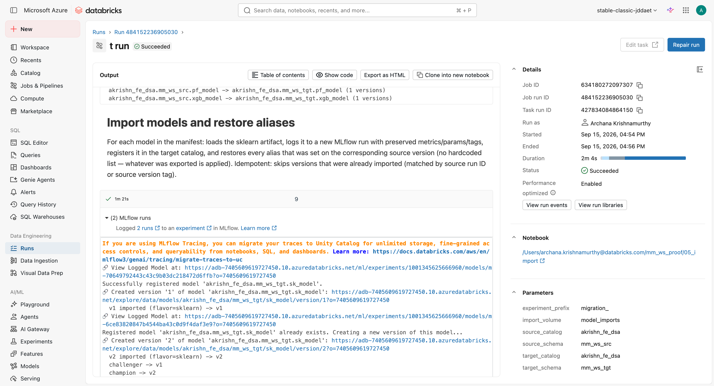
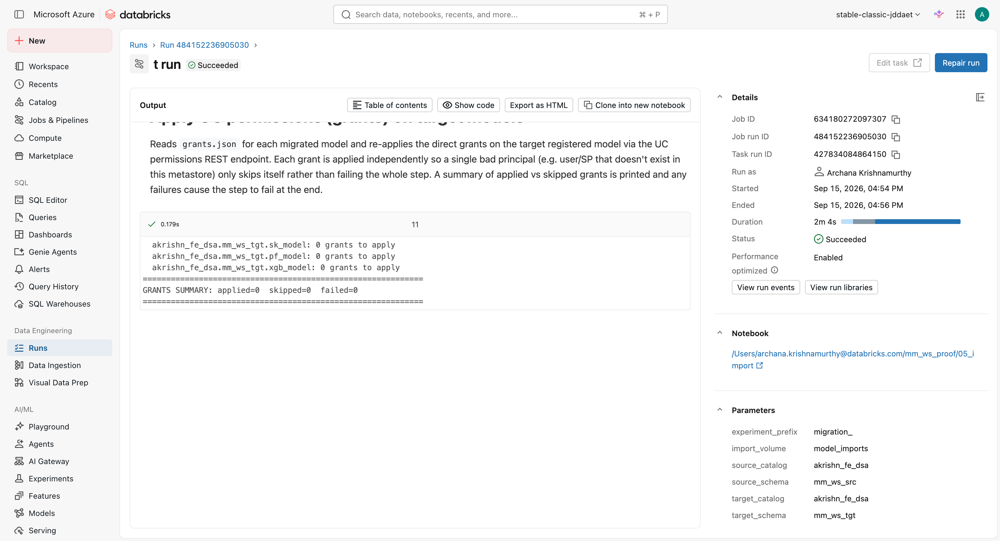
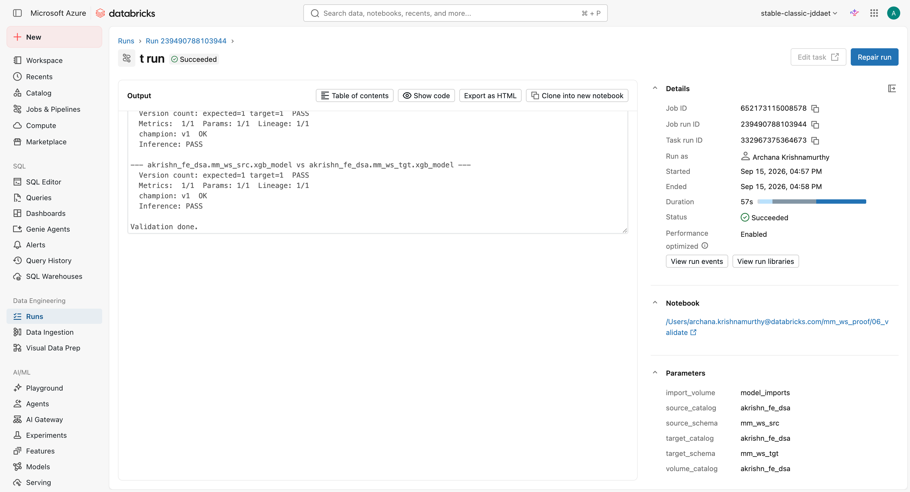
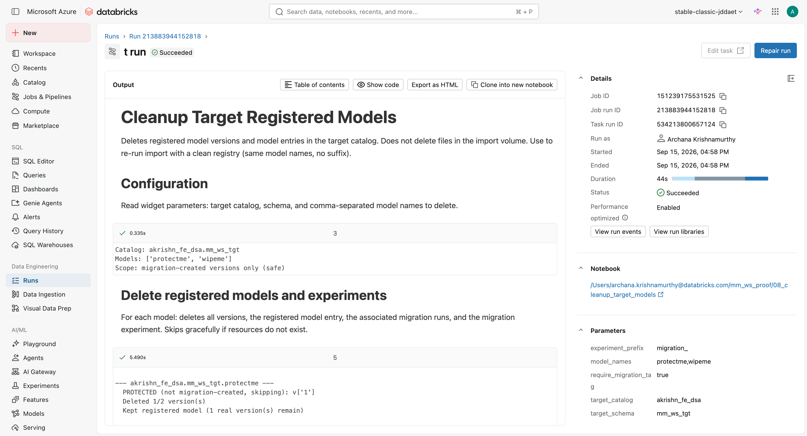
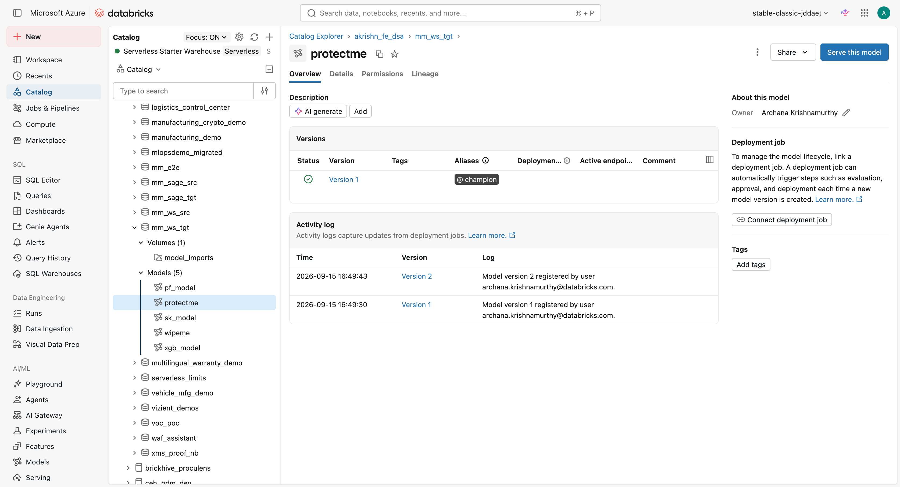

# Workspace Proof: merged fix deployed and run on synthetic models

This is the post-merge verification the way a human would check it: the **merged** `main`
code (merge commit `28c29f5`) was pulled fresh, imported into the fevm Azure workspace
(`adb-7405609619727450`), and run as real serverless notebook jobs on synthetic models.
Every notebook run finished **Succeeded**, and every cell output was reviewed in the
Databricks run UI. Screenshots are in `docs/workspace_proof/`.

Catalog `akrishn_fe_dsa`, schemas `mm_ws_src` (source) -> `mm_ws_tgt` (target).
Synthetic models: `sk_model` (sklearn, 2 versions, Champion + Challenger), `pf_model`
(custom pyfunc), `xgb_model` (xgboost); plus `protectme` (real v1 + Champion, and a
migration-tagged v2) and `wipeme` (real, untagged) for the cleanup test.

## Run summary (all Succeeded)

| Notebook | Task run ID | Duration | Result |
|----------|-------------|----------|--------|
| 03_export | 364999054123659 | ~ | Succeeded (2 + 1 + 1 versions exported) |
| 04_transfer | 248691695720012 | ~ | Succeeded |
| 05_import | 427834084864150 | 2m 4s | Succeeded (ok=4 fail=0) |
| 06_validate | 332967375364673 | 57s | Succeeded (all Inference: PASS) |
| 08_cleanup | 534213800657124 | 44s | Succeeded (scoped) |

## 1. Import is flavor-agnostic (Issue 2)

`05_import` imported all three flavors and restored aliases. The run UI shows
`v1 imported (flavor=sklearn) -> v1`, `v2 imported (flavor=sklearn) -> v2`,
`challenger -> v1`, `champion -> v2`, and the models registered in UC.

Grants cell ran cleanly (nothing to apply here) and the step reported success:

## 2. Validation passes inference for every flavor (Issue 2)

`06_validate` loads each target model via `mlflow.pyfunc` and predicts from the
signature. `pf_model` (pyfunc) and `xgb_model` (xgboost) both report **`Inference: PASS`**
(the exact case that used to falsely FAIL), version counts / metrics / params / lineage
all match, aliases OK, ending with `Validation done.`

## 3. Cleanup is scoped and protects real models (Issue 1)

`08_cleanup` run with `require_migration_tag = true` on `protectme` and `wipeme`:
`protectme` v1 is `PROTECTED (not migration-created, skipping)`, only the migration
version is deleted (`Deleted 1/2`), and the registered model is kept. `wipeme` is
untouched (`Deleted 0/1`).

## 4. End state in Unity Catalog

The Catalog confirms it independently: `protectme` now shows **only Version 1 with the
`@champion` alias** (the migration-created v2 was removed), and all five models are
present in `mm_ws_tgt`. A real model that shared a name with a migration was not wiped.

## Conclusion

The merged fix, deployed and run in the workspace on synthetic sklearn / pyfunc /
xgboost models, migrates every flavor with `Inference: PASS`, preserves aliases, and
scopes cleanup so a real target model survives. No errors in any cell.
